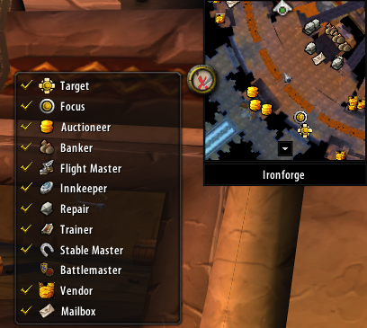

# VanillaMinimapTracking

Adds custom blip icons to the minimap in WoW 1.12.1 (Turtle WoW / VanillaFixes).
Lets you see your target, focus, vendors, auctioneers, mailboxes, and other
NPC types as recognizable icons on the minimap, hover them for tooltips
(including unit subtitles like `<Innkeeper>`), and toggle each category from
a small button next to the minimap.



## What's in this repo

- **`src/`** — a C++ DLL that injects into WoW.exe via the VanillaFixes loader.
  It hooks WoW's per-frame visible-object enumeration and the minimap render
  pipeline to draw extra blips and inject hover-tooltip text. It owns the
  per-character config (lazy-loaded from `WTF\Account\<account>\<realm>\
  <character>\VanillaMinimapTracking.cfg` on first API call after login,
  written back on every toggle) and exposes a small Lua API + a custom
  `MINIMAP_BLIP_TRACKING_CHANGED` event.
- **`MinimapBlips/`** — a companion WoW addon that puts the toggle button on
  the minimap and renders the category menu. It's a thin UI on top of the
  DLL's Lua API — no `SavedVariables`, no path knowledge. Without the DLL
  loaded, the addon shows a chat warning and does nothing.

## Categories

The current category menu (managed in
[`MinimapBlips/MinimapBlipsMenu.lua`](MinimapBlips/MinimapBlipsMenu.lua)):

- **Target** — your current target. A separate hostile-target icon is used
  if you can't assist the target (uses `CGUnit_C::CanAssist`).
- **Focus** — a pseudo-focus unit (vanilla 1.12.1 has no native focus). Set
  with `C_MinimapBlip.SetFocus()` / `C_MinimapBlip.SetFocusByName(name)`.
- **Auctioneer, Banker, Flight Master, Innkeeper, Repair, Trainer,
  Stable Master, Battlemaster, Vendor** — NPCs matched by their
  `m_npcFlags` field.
- **Mailbox** — game objects of type `MAILBOX`.

Self-targeting and self-focus are filtered out — your own character won't
get a target/focus blip placed on you.

## Build

Requirements: Windows, MSVC (Visual Studio 2019+ Build Tools), CMake 3.10+,
Git.

```powershell
cd C:\Git\VanillaMinimapTracking
git submodule update --init --recursive
cmake -B build -A Win32
cmake --build build --config Release
```

`-A Win32` is mandatory — WoW 1.12.1 is a 32-bit process. Output is
`build\Release\VanillaMinimapTracking.dll`.

To produce a tagged release build with a baked-in version value:

```powershell
cmake -B build -A Win32 -DVANILLAMINIMAPTRACKING_TAG=v1.2.3
cmake --build build --config Release
```

## Install

1. **DLL:** drop `build\Release\VanillaMinimapTracking.dll` into the folder
   VanillaFixes loads DLLs from (typically next to the WoW.exe loaded by
   VanillaFixes).
2. **Addon:** copy the entire `MinimapBlips/` folder to
   `<WoW>\Interface\AddOns\MinimapBlips\`.

Both the DLL and the addon need to be installed — the addon detects the DLL
via the `C_MinimapBlip` namespace and refuses to load if the DLL is missing.

## Lua API

Functions live on the `C_MinimapBlip` namespace table (Blizzard's `C_*` style).
All take **lowercase** type names (`"target"`, `"flight master"`, `"mailbox"`,
etc.).

| Function                                                              | Returns             | Notes                                                                       |
|-----------------------------------------------------------------------|---------------------|-----------------------------------------------------------------------------|
| `C_MinimapBlip.RegisterIcons({{type, icon, scale, hostileIcon?}, ...})` | —                   | Bulk-register icons in one call. `hostileIcon` is only honored on `target`. |
| `C_MinimapBlip.RegisterIcon(type, icon, scale)`                       | —                   | Single-icon variant.                                                        |
| `C_MinimapBlip.RegisterHostileIcon(icon, scale)`                      | —                   | Sets the hostile-target variant separately.                                 |
| `C_MinimapBlip.Track(type, 0\|1)`                                      | —                   | Toggle a category on/off. Persists immediately.                              |
| `C_MinimapBlip.IsTracked(type)`                                        | `1` or `nil`        | `if C_MinimapBlip.IsTracked(t) then ... end`.                               |
| `C_MinimapBlip.GetTracked()`                                           | `{type=1, ...}` set | All currently-tracked types as a set keyed by lowercase name.               |
| `C_MinimapBlip.SetFocus()`                                             | —                   | Captures the current target as the focus unit.                              |
| `C_MinimapBlip.SetFocusByName(name)`                                   | —                   | Captures a unit by name (silent fail if not found).                         |
| `C_MinimapBlip.ClearFocus()`                                           | —                   | Drops the focus.                                                            |

To detect whether the DLL is loaded, just check the namespace:
`if C_MinimapBlip then ... end`.

A real WoW event fires whenever tracking state changes — register it with
`frame:RegisterEvent("MINIMAP_BLIP_TRACKING_CHANGED")` and dispatch from the
addon's `OnEvent` like any built-in event. Args: `arg1` = type name, `arg2`
= `1` (enabled) or `0` (disabled).

## Notes for the curious

The DLL hooks a handful of well-known WoW 1.12.1 functions to render extra
blips (see [`src/Blips.cpp`](src/Blips.cpp)) and reads creature subnames
directly out of the in-memory creature cache (`unit + 0xB30 → cache + 0x10`).
Per-character path resolution uses three engine session globals
(`0x00BE1C0C`, `0x00C28130+0x20`, `0x00C27D88`) — the same trio WoW itself
reads to write `AddOns.txt` and other per-character WTF files (see
[ClassicAPI/docs/SessionGlobals.md](https://github.com/brues-code/ClassicAPI/blob/main/docs/SessionGlobals.md)).
The custom `MINIMAP_BLIP_TRACKING_CHANGED` event is dispatched via the
engine's own event table by claiming an unused slot — addons listen for it
exactly the same way they would for a built-in event.
